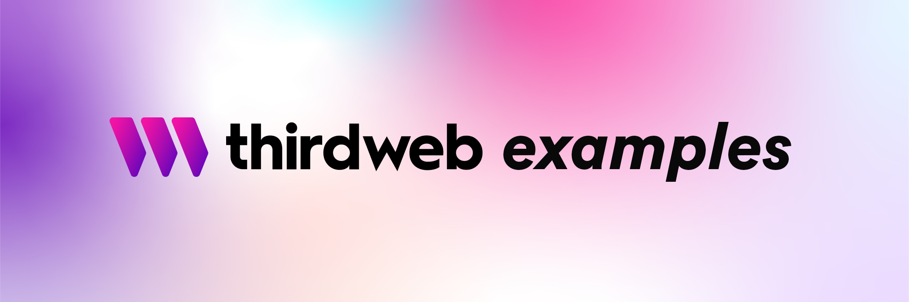

<!-- Banner Image -->

 

  

    web3sdks examples to kickstart your next project, or to learn more about using web3sdks's features!
  

 

  <a href="https://docs.web3sdks.com/">web3sdks Portal</a> •
  <a href="https://github.com/orgs/web3sdks/repositories">web3sdks</a> •
  <a href="https://discord.com/invite/web3sdks">Join our Discord</a>

 

## Starter Kits

| Framework        | Language   | Example Project                                                                    |
| ---------------- | ---------- | ---------------------------------------------------------------------------------- |
| Create React App | JavaScript | [Link](https://github.com/web3sdks-template/cra-javascript-starter)  |
| Create React App | TypeScript | [Link](https://github.com/web3sdks-template/cra-typescript-starter)  |
| Next.js          | JavaScript | [Link](https://github.com/web3sdks-template/next-javascript-starter) |
| Next.js          | TypeScript | [Link](https://github.com/web3sdks-template/next-typescript-starter) |
| Vite             | JavaScript | [Link](https://github.com/web3sdks-template/vite-javascript-starter) |
| Vite             | TypeScript | [Link](https://github.com/web3sdks-template/vite-typescript-starter) |

